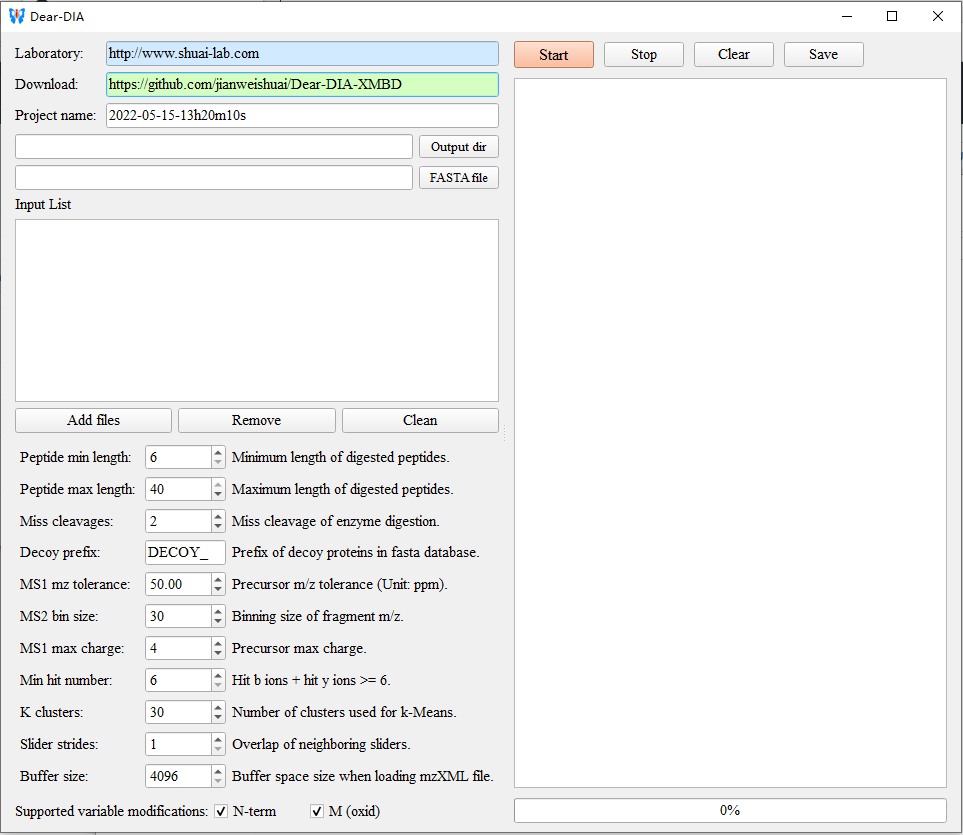
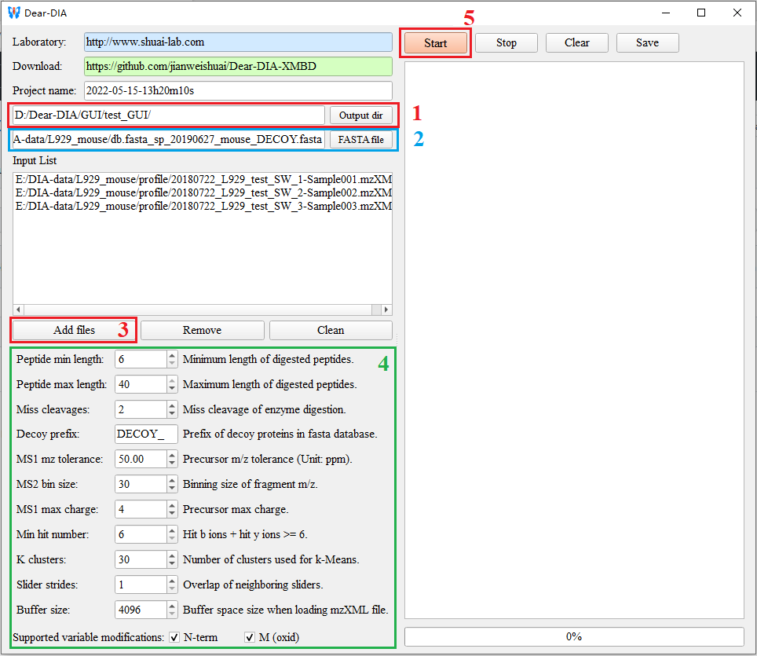
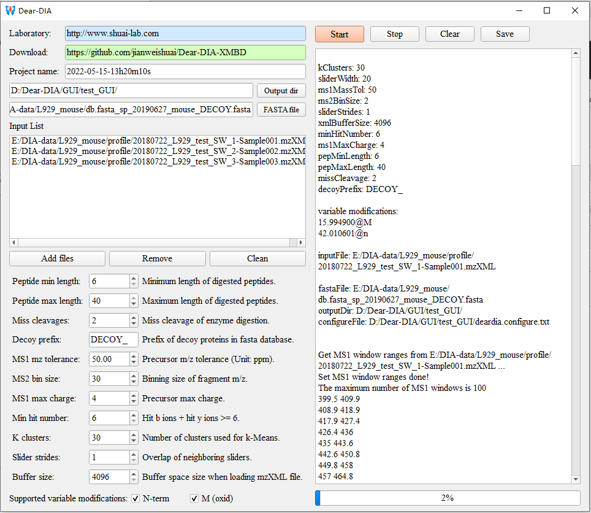

# <p align="center"> Dear-DIA<sup>XMBD</sup></p> 
## <p align="center">Deep autoencoder for data-independent acquisition proteomics</p> 

## Introduction
Dear-DIA<sup>XMBD</sup> is a spectrum-centric method that combines the deep variational autoencoder (VAE) with other machine learning algorithms, to detect the correspondence between precursors and fragments in DIA data without the help of DDA experiments. 

- Dear-DIA<sup>XMBD</sup> produces the pseudo-tandem MS spectra to search database, and generates the internal libraries. 
- Dear-DIA<sup>XMBD</sup> can be easily integrated into the existing workflow, because the output file of Dear-DIA<sup>XMBD</sup> is in MGF format that can be processed by common search engines, including Comet, X!Tandem and MSFragger etc. 
- Furthermore, benefiting from the fact that the autoencoder is an unsupervised deep learning model, Dear-DIA<sup>XMBD</sup> shows an excellent performance on the DIA data of different species obtained by different instrument platforms.
- Dear-DIA<sup>XMBD</sup> is a **cross-platform open source** software and follows the GPL v3.0 licence. **Users can download and use Dear-DIA<sup>XMBD</sup> for free.**

**Download:** [Dear-DIA-GUI-win-x64-free-install.zip](https://github.com/jianweishuai/Dear-DIA-XMBD/releases)


## 简介
Dear-DIA<sup>XMBD</sup>是一款以谱图为中心的DIA数据分析软件。它不需要DDA实验的帮助，而是使用深度变分自编码器（VAE）和机器学习算法来检测DIA数据中母离子和子离子的对应关系。

- Dear-DIA<sup>XMBD</sup>输出伪串联质谱图来进行数据库搜索从而生成内部谱图库（library）。
- Dear-DIA<sup>XMBD</sup>输出MGF文件，这使得它非常容易被整合进现有的分析工作流中。同时，它的输出文件也可以被Comet，X!Tandem和MSFragger等搜索引擎进一步处理。
- 此外，得利于自编码器属于无监督学习模型，Dear-DIA<sup>XMBD</sup>在来自不同仪器采集的不同物种的DIA数据上均表现出优秀的性能。
- Dear-DIA<sup>XMBD</sup>是一款**跨平台的开源软件**，其遵循GPL v3.0协议。**用户可以免费下载并使用它**。

**下载链接** [Dear-DIA-GUI-win-x64-free-install.zip](https://github.com/jianweishuai/Dear-DIA-XMBD/releases)


## Installation
If you have any problems installing the software, please feel free to contact us.

### Windows System
**Free installation:** [Dear-DIA-GUI-win-x64-free-install.zip](https://github.com/jianweishuai/Dear-DIA-XMBD/releases)
```
1. download the newest "Dear-DIA-GUI-win-x64-free-install.zip" file.
2. decompress this file to any path.
3. double click "Dear-DIA-GUI.exe" with a blue butterfly icon..
```

### Linux System
**Linux source code:** [Dear-DIA-linux-src-x86_64.zip](https://github.com/jianweishuai/Dear-DIA-XMBD/releases)
- **Note: need g++ >= 5.4.0 or compiler support c++11**
- "Dear-DIA-linux-src-x64.zip" file contains source code, dependencies and binary release file “deardia” compiled on CentOS 7.8 system. Users can try to run the executable file “deardia” on other linux systems such as Ubuntu system.
```
1. download the "Dear-DIA-linux-src-x86_64.zip" file.
2. decompress the "Dear-DIA-linux-src-x86_64.zip" to your linux server.
3. Enter the "make" command in the unzipped directory containing the Makefile.
4. Complete compilation.
```

## 软件安装
如果您在安装软件时遇到任何问题，欢迎随时联系我们。

### Windows系统
请下载免安装版本： [Dear-DIA-GUI-win-x64-free-install.zip](https://github.com/jianweishuai/Dear-DIA-XMBD/releases)

```
1. 下载最新的压缩文件："Dear-DIA-GUI-win-x64-free-install.zip"
2. 解压此文件到任意目录。
3. 双击带有蓝色蝴蝶图标的软件"Dear-DIA-GUI.exe"
```

### Linux系统
请下载Linux源代码：[Dear-DIA-linux-src-x86_64.zip](https://github.com/jianweishuai/Dear-DIA-XMBD/releases)
- **注意：** 源码编译需要g++>=5.4.0或者编译器支持c++11
- "Dear-DIA-linux-src-x64.zip"文件包含在CentOS 7.8系统上编译的源代码、依赖项和二进制可执行文件“deardia”。 用户可以尝试在其他linux系统如Ubuntu系统上运行可执行文件“deardia”。
```
1. 下载"Dear-DIA-linux-src-x86_64.zip"文件。
2. 在Linux系统上解压此文件。
3. 在包含Makefile文件的解压目录下输入"make"命令并按回车键。
4. 等待编译结束。
```

## Usage 使用教程

### Windows 
```
1. Double click "Dear-DIA-GUI.exe"
一、双击"Dear-DIA-GUI.exe"。
```


```
2. Configure the parameters
二、配置相应的参数。
```


```
3. Click "start" button and wait for finishing.
三、单击"开始"按钮并等待程序完成运行。
```


### Linux

```
./deardia --config=deardia.config.new --out_dir=/path/to/ouput_dir --input=/path/to/mzXML_file
```

## Update News

- **2022.6.01 updatde:** Upgrade Dear-DIA to support mzML, mzXML, wiff and raw formats.
- **2022.5.30 updatde:** fix some BUGs.

## 更新消息

- **2022.6.01更新:** 升级Dear-DIA以支持mzML，mzXML，wiff和raw格式.
- **2022.5.30更新:** 修复一些错误.

## Supported data format

- **2022.6.01 updatde:** Support wiff (Sciex) and raw (ThermoFisher) formats.
- **2022.5.31 updatde:** Support mzML format.
- **2022.5.21 updatde:** Support mzXML format.

## 支持的数据格式

- **2022.6.01更新:** 支持wiff (Sciex)和raw (ThermoFisher)格式.
- **2022.5.31更新:** 支持mzML格式.
- **2022.5.21更新:** 支持mzXML格式.

## Future updates
We will consider the following features in future releases.
- Support vendor formats including .wiff and .raw.
- Support more post-translation modifications.

## 今后更新
我们将在今后的版本中考虑以下新特性：
- 支持包含.wiff和.raw在内的商业格式。
- 支持更多翻译后修饰。

## Contact

- Please post any questions, feedback, comments or suggestions on the  [GitHub Discussion board](https://github.com/jianweishuai/Dear-DIA-XMBD/issues).
- Email: qingzuhe@stu.xmu.edu.cn; jianweishuai@xmu.edu.cn; jhan@xmu.edu.cn

## 联系我们
- 您可以将任何问题或使用反馈和建议提交到GitHub的[讨论面板](https://github.com/jianweishuai/Dear-DIA-XMBD/issues)中。
- 此外，欢迎通过邮件联系我们：qingzuhe@stu.xmu.edu.cn; jianweishuai@xmu.edu.cn; jhan@xmu.edu.cn
